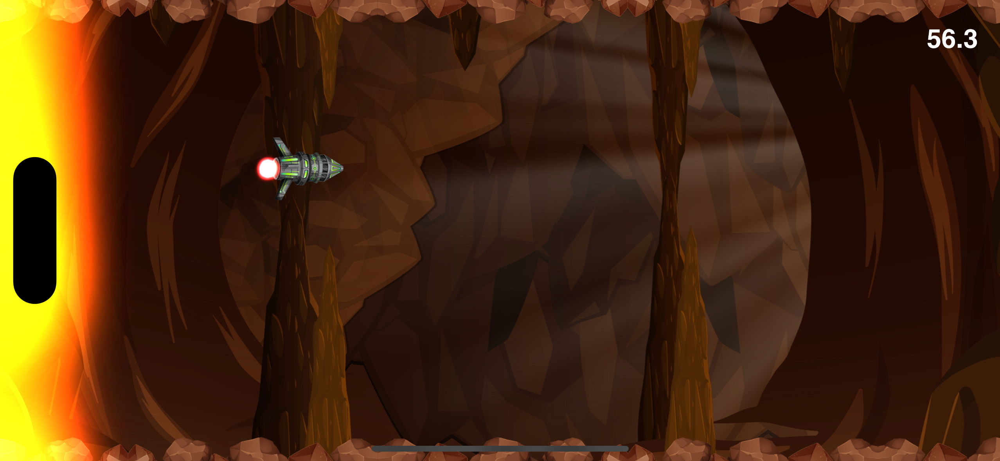

# Cave Adventure Go 🏔️

[](https://developer.apple.com/ios/)
[](https://swift.org/)
[](LICENSE)
[](https://www.apple.com/ios/)

An exciting endless runner game where you navigate through treacherous cave passages, avoiding obstacles and collecting treasures. Built with SpriteKit for iOS.



## 🎮 Game Features

- **Endless Runner Gameplay**: Navigate through procedurally generated cave passages
- **Physics-Based Movement**: Realistic gravity and collision detection
- **Progressive Difficulty**: Game speed increases over time for challenging gameplay
- **Score System**: Track your best scores with persistent storage
- **Multi-language Support**: Available in English, Simplified Chinese, and Traditional Chinese
- **Ad Integration**: Google Mobile Ads for monetization
- **Particle Effects**: Beautiful visual effects including lava and player trails
- **Background Music**: Immersive audio experience

## 🚀 Getting Started

### Prerequisites

- Xcode 12.0 or later
- iOS 11.0+ deployment target
- CocoaPods for dependency management

### Installation

1. Clone the repository
```bash
git clone https://github.com/banghuazhao/cave-adventure-go.git
cd cave-adventure-go
```

2. Install dependencies
```bash
pod install
```

3. Open the workspace
```bash
open "Cave Adventure Go.xcworkspace"
```

4. Build and run the project in Xcode

## 🛠️ Technical Details

### Architecture
- **Framework**: SpriteKit for 2D game development
- **Language**: Swift 5.0
- **Dependencies**: Managed via CocoaPods

### Key Components

- **GameScene.swift**: Main game logic and physics
- **GameViewController.swift**: View controller for game presentation
- **Assets**: Sprites, sounds, and particle effects
- **Localization**: Multi-language support for global audience

### Dependencies

- `Localize-Swift`: Internationalization support
- `SwiftyButton`: Custom button implementations
- `SnapKit`: Auto Layout constraints
- `Then`: Object initialization
- `Google-Mobile-Ads-SDK`: Ad monetization

## 🎯 Game Mechanics

### Controls
- **Tap to Jump**: Simple one-touch controls
- **Gravity Physics**: Realistic falling mechanics
- **Collision Detection**: Precise obstacle avoidance

### Scoring
- Score increases based on distance traveled
- Best score is automatically saved
- Progressive difficulty scaling

### Obstacles
- **Walls**: Randomly generated cave walls
- **Ground**: Moving terrain elements
- **Lava**: Visual hazard effects

## 📱 Platform Support

- **iOS**: 11.0 and later
- **Devices**: iPhone and iPad
- **Orientation**: Landscape only
- **Architecture**: ARMv7 and later

## 🎨 Assets

The game includes:
- Custom sprite graphics
- Background music and sound effects
- Particle system effects
- App icons for various sizes

## 📊 Analytics & Monetization

- **Google Mobile Ads**: Banner and interstitial ads
- **SKAdNetwork**: Privacy-compliant attribution
- **User Tracking**: Personalized ad delivery (with permission)

## 🤝 Contributing

1. Fork the repository
2. Create your feature branch (`git checkout -b feature/AmazingFeature`)
3. Commit your changes (`git commit -m 'Add some AmazingFeature'`)
4. Push to the branch (`git push origin feature/AmazingFeature`)
5. Open a Pull Request

## 📄 License

This project is licensed under the MIT License - see the [LICENSE](LICENSE) file for details.

## 👨‍💻 Author

**Banghua Zhao**
- GitHub: [@banghuazhao](https://github.com/banghuazhao)

## 🙏 Acknowledgments

- Built with SpriteKit framework
- Sound effects and music assets
- Particle system effects
- Localization support

---

⭐ If you find this project helpful, please give it a star on GitHub! 